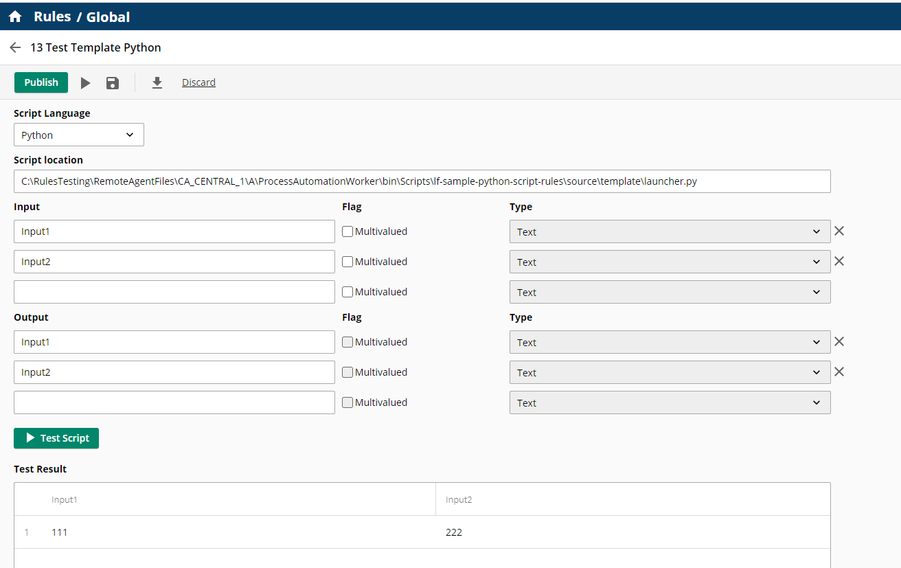
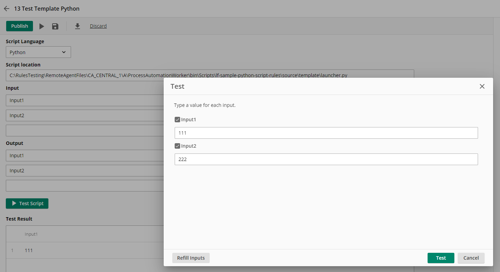
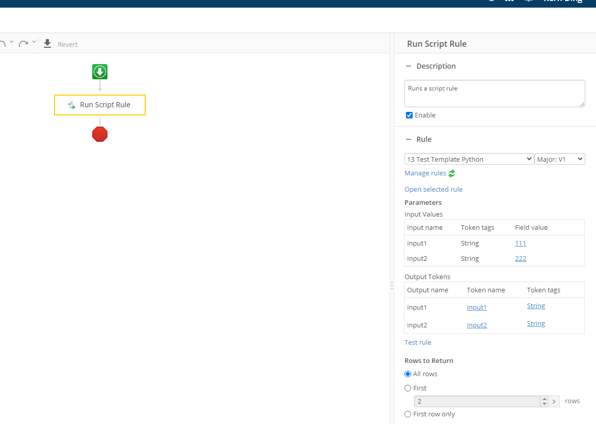

# Laserfiche Python Rule script Template project
This project is a template for creating a Laserfiche Python Rule script project. It contains a sample script that can be used as a starting point for creating your own script.

## Deploy script to your remote agent
- Copy the whole repo into the remote agent folder
    - e.g., `C:\Program Files\Laserfiche\Server\RemoteAgent\ScriptRunner\Python\lf-sample-python-script-rules`
- Add the remote agent location into the **PYTHONPATH**
  ```python
  import os
  os.environ['PYTHONPATH'] = r'C:\Program Files\Laserfiche\Server\RemoteAgent\ScriptRunner\Python\lf-sample-python-script-rules'
  ```
  
## Configure and test this script rule in your Laserfiche Cloud Account -> Process Automation -> Rules

Create a new rule:

- Select the script rule type: Python
- Script location: `C:\Program Files\Laserfiche\Server\RemoteAgent\ScriptRunner\Python\lf-sample-python-script-rules\source\template\launcher.py`
- Input:
    - Input1
    - Input2
- Output:
    - Input1
    - Input2



## Test the rule

Providing two string inputs, this script would echo the inputs


## Test script rule in a workflow

Run the workflow and verify the script echo the inputs

