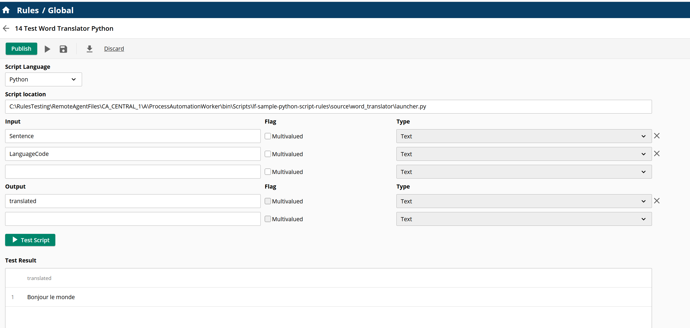
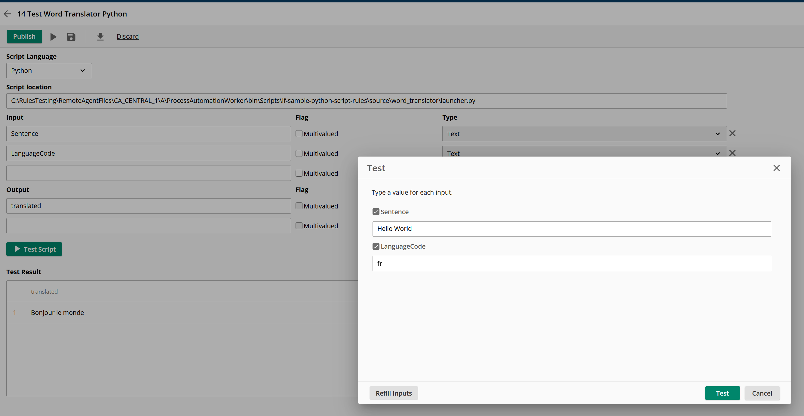
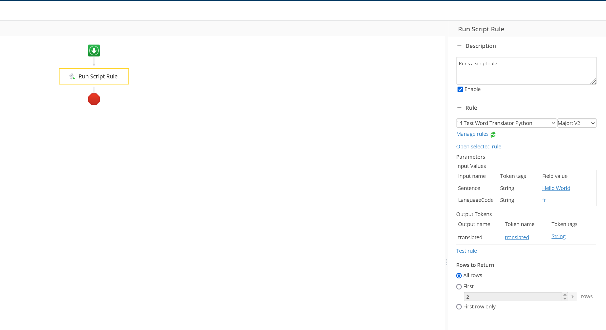

# Laserfiche Python Rule script Word Translator project

This project is a sample script to show how to import 3rd party pip packages in a Laserfiche Python Rule script project.

## Deploy script to your remote agent
 Refer to the [Deployment](../../README.md#deployment) for details.

## Configure and test this script rule in your Laserfiche Cloud Account -> Process Automation -> Rules

Create a new rule:

- Select the script rule type: Python
- Script location: `C:\Program Files\Laserfiche\Server\RemoteAgent\ScriptRunner\Python\lf-sample-python-script-rules\source\word_translator\launcher.py`
- Input:
    - Sentence: the words to translate
    - fr: translate to French
- Output:
    - translated: the translated words

## Test the rule

Providing sentence and language code to be translated, this script would translate the sentence. 

## Test script rule in a workflow

Run the workflow and verify the script translate the sentence

